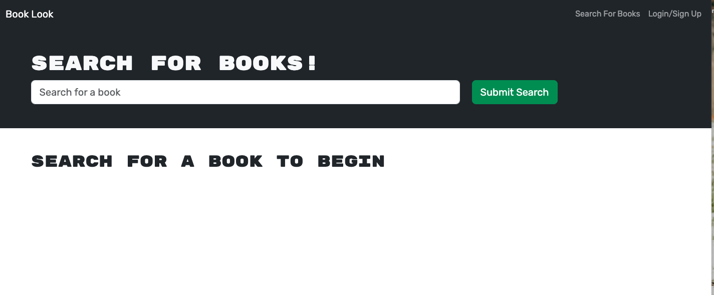
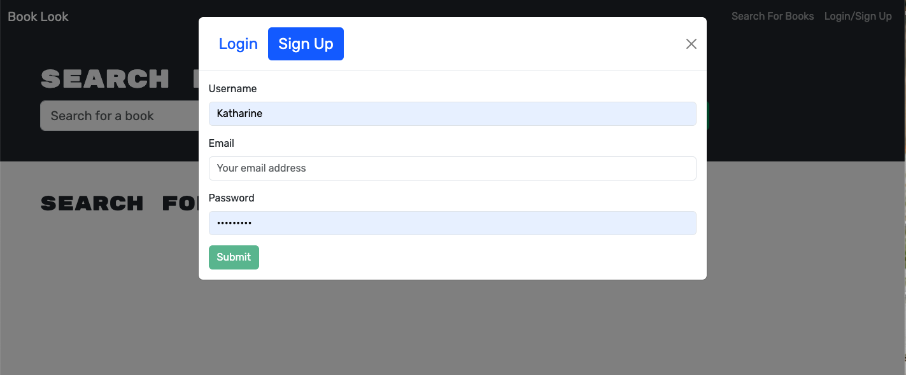
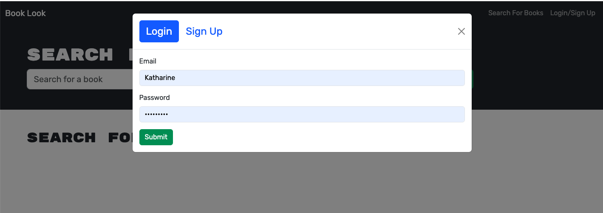
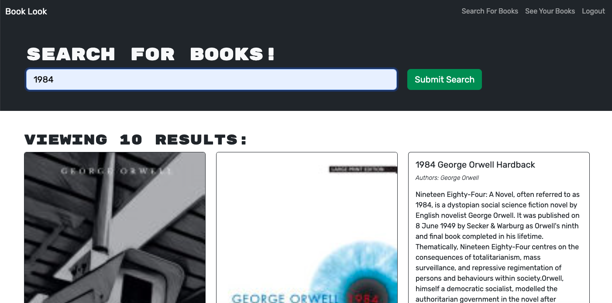

# Book Look

## Description:
Book Look is built using the MERN stack with a React front end. It is designed for avid readers to be able to search for new books to read and keep a list of books to purchase.

## Table of Contents

- [Description](#description)
- [Usage](#usage)
- [Demonstration](#demonstration)
- [Contributions](#contributions)
- [Links](#links)
- [Technologies](#technologies)
- [License](#license)

## Usage:

**Interface**: Please visit Book Look using the Heroku link.

**User**: As a user of Book Look, you can:
- Create an account
- Log into your account
- Search for books
- View titles that match your search, including book covers, authors, and descriptions
- Save books
- View your saved books
- Delete books from your saved books
- Logout

## Demonstration:

1. **Home Page**

2. **Create an Account**

3. **Log into your Account**

4. **Search Books**

5. **View Book Info**

6. **Save Book**

7. **Remove from Saved**

## Contributions:

Contributions to Book Look are welcome! If you have any improvements, bug fixes, or new features to add, feel free to submit a pull request.

To contribute to Book Look, please follow these steps:

1. Fork the repository.
2. Create a new branch for your feature or bug fix.
3. Make your changes in the new branch.
4. Commit your changes, providing a descriptive commit message.
5. Push your branch to your forked repository.
6. Open a pull request against the main repository.
7. Provide a clear and concise description of your changes in the pull request.
8. Submit the pull request and wait for feedback or further instructions.

Please note that by submitting a pull request, you agree to allow the project maintainers to license your work under the project's existing license.

Thank you for considering contributing to Book Look. Your contributions are highly appreciated!

## Links:
- Repository: [Link to Repository](repository-link-goes-here)
- Deployed Application: [Link to Deployed Application](deployed-application-link-goes-here)

## Technologies

- Google Books API refactored to be a GraphQL API
- Apollo Server
- MERN stack
- React front end
- Node.js/Express.js server and API
- Deployed with Heroku with a MongoDB database using MongoDB Atlas

## License:
Book Look is licensed under the [MIT License](https://opensource.org/licenses/MIT).

_The MIT License is a permissive open-source license that allows you to use, modify, and distribute the project for both commercial and non-commercial purposes. It provides you with the freedom to customize the application to suit your needs._

_By contributing to Book Look, you agree that your contributions will be licensed under the same MIT License. This ensures that the project remains open-source and accessible to the community._
